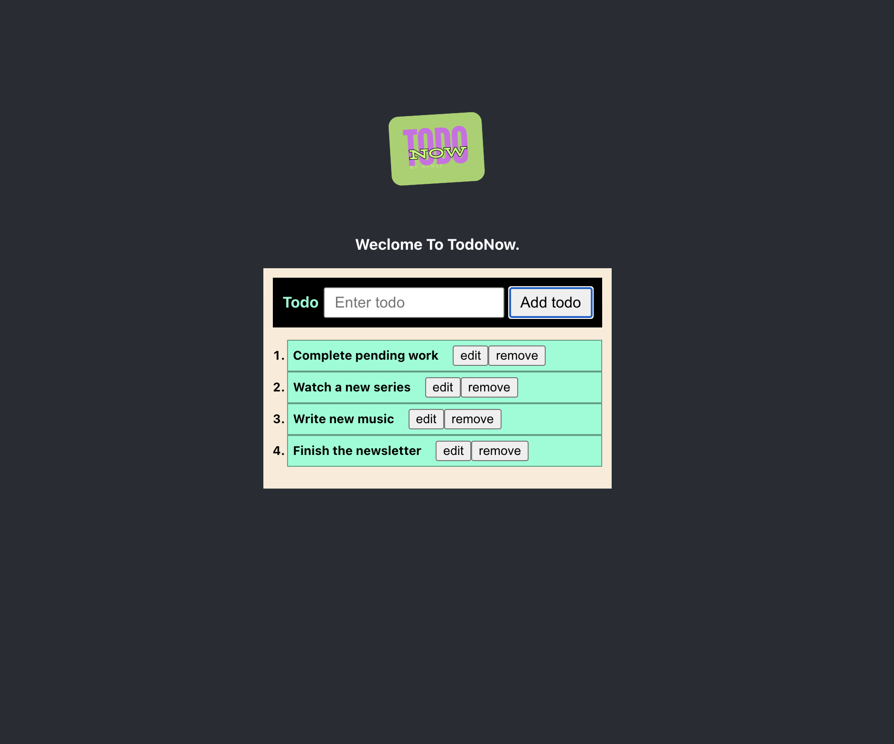

# TodoNow App



## Overview

This is a simple Todo application built with React. It allows users to add, remove, and update todo items.

## Features

- **Add Todo**: Users can add new todo items to the list.
- **Remove Todo**: Users can remove todo items from the list.
- **Update Todo**: Users can update existing todo items.

## Usage

1. Clone this repository.
2. Install dependencies using `npm install`.
3. Run the app with `npm start`.
4. Open your browser and navigate to `http://localhost:3000` to use the Todo app.

## Technologies Used

- React
- JavaScript
- HTML
- CSS

## Folder Structure

```
├── public
│   ├── index.html
│   └── ...
├── src
│   ├── NewTodoForm
│   │   ├── NewTodoForm.js
│   │   ├── NewTodoForm.css
│   │   └── NewTodoForm.test.js
│   ├── Todo
│   │   ├── Todo.js
│   │   ├── Todo.css
│   │   └── Todo.test.js
│   └── TodoList
│       ├── TodoList.js
│       ├── TodoList.css
│       └── TodoList.test.js
├── App.js
├── index.js
└── ...
```

## Contributing

Contributions are welcome! Please feel free to submit issues and pull requests.

## License

This project is licensed under the MIT License - see the [LICENSE](LICENSE) file for details.
